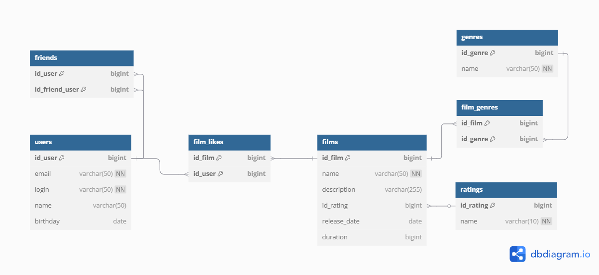

# java-filmorate
Template repository for Filmorate project.

**-- Вывод всех полей и записей из таблицы фильмы** 
SELECT * 
FROM films;

**-- Вывод всех полей записи под id=1** 
SELECT * 
FROM films 
WHERE id_film = 1;

**-- Вывод записи и всех полей из таблицы Фильмы по определенному жанру** 
SELECT f.* 
FROM films f 
JOIN film_genres fg ON f.id_film = fg.id_film 
JOIN genres g ON fg.id_genre = g.id_genre 
WHERE g.name = '*****';

**-- Вывод записей и всех полей из таблицы Фильмы по определенному рейтингу** 
SELECT f.* 
FROM films f 
JOIN ratings r ON f.id_rating = r.id_rating 
WHERE r.name = '*****';

**-- Вывод количества лайков по названию фильма** 
SELECT COUNT(*) AS like_count 
FROM film_likes fl 
JOIN films f ON fl.id_film = f.id_film 
WHERE f.name = '*****';

**-- Вывод записей и всех полей из таблицы Пользователи по названию фильма** 
SELECT u.* 
FROM users u 
JOIN film_likes fl ON u.id_user = fl.id_user 
JOIN films f ON fl.id_film = f.id_film 
WHERE f.name = '*****';

**-- Вывод записей и всех полей из таблицы Фильмы, которые пролайкал определенный пользователь** 
SELECT f.* 
FROM films f 
JOIN film_likes fl ON f.id_film = fl.id_film 
JOIN users u ON fl.id_user = u.id_user 
WHERE u.login = '*****';

**-- Вывод записей и всех полей из таблицы Фильмы + поле по количеству лайков с группировкой и сортировкой по убыванию и определенному количеству** 
SELECT f.*,  
&nbsp;&nbsp;&nbsp;&nbsp;&nbsp;&nbsp;&nbsp;&nbsp;&nbsp;&nbsp;&nbsp;&nbsp;COUNT(fl.id_film) AS like_count 
FROM films f 
LEFT JOIN film_likes fl ON f.id_film = fl.id_film 
GROUP BY f.id_film 
ORDER BY like_count DESC 
LIMIT ***;

**-- Вывод статуса дружбы пользователей** 
SELECT sf.name AS friendship_status 
FROM friends f 
JOIN status_friendship sf ON f.id_status_friendship = sf.id_status_friendship 
WHERE f.id_user = *** 
&nbsp;&nbsp;&nbsp;&nbsp;&nbsp;&nbsp;&nbsp;&nbsp;&nbsp;&nbsp;&nbsp;&nbsp;AND f.id_friend_user = ***** 